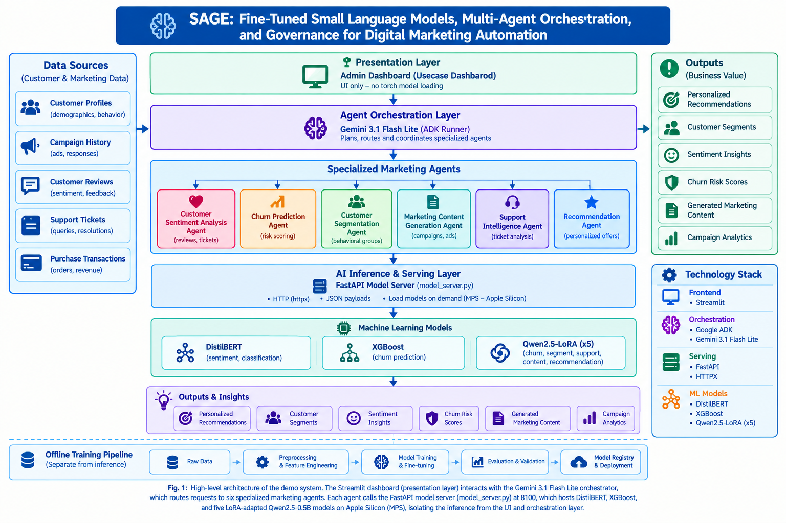

# SAGE: Fine-Tuned Small Language Models, Multi-Agent Orchestration, and Governance for Digital Marketing Automation

*A reproducible, agentic marketing platform for customer-experience decision
support.*

SAGE combines a Gemini-powered orchestrator with six specialist agents and
locally served machine-learning models for sentiment, churn, segmentation,
support routing, content strategy, and product recommendation.

The architecture and workflows documented here follow the accompanying
multi-agent system paper and system architecture diagram. This repository
is an academic/local system: it does not connect to live CRM, email,
advertising, or social-media platforms.

## Problem Statement

Digital marketing teams typically operate across disconnected tools: a CRM
for segmentation, a separate analytics stack for churn and sentiment, another
tool for support triage, and yet another for content or recommendation
decisions. Each tool requires its own integration, its own data handling, and
a human to manually connect insights from one system to action in another —
segmentation findings don't automatically become a content strategy; a
churn signal doesn't automatically trigger a retention workflow; a support
ticket doesn't automatically route to the right queue. The result is slower
decisions, duplicated data handling, and risk signals that surface too late
to act on.

Cloud-hosted LLM platforms can unify these workflows, but introduce their own
trade-off: per-token cost that scales with usage, customer data leaving the
organisation on every call, and dependency on a single vendor's pricing and
availability.

SAGE addresses both problems at once. A cloud-hosted LLM handles only the
coordination layer — deciding which task is being asked for and routing it —
while locally fine-tuned small language models and predictive models perform
the actual classification and prediction on-device. This repository
demonstrates that architecture end-to-end through two customer-experience
scenarios, [Alpha](#alpha--product-company) and
[Beta](#beta--subscription-service-provider), each built from one or more
chained agent decisions rather than a single isolated prediction.

## Architecture




The Streamlit process is UI-only. Torch-based inference is isolated in the
FastAPI model server so the dashboard remains responsive and model resources
are managed in a separate process. ADK callbacks record model calls, tool
calls, latency, errors, token usage, and cost evidence.

## Specialist agents

| Agent | Local model/tool | Output |
| --- | --- | --- |
| Sentiment | Fine-tuned DistilBERT | Negative, neutral, or positive sentiment |
| Churn | XGBoost and Qwen2.5 LoRA | Churn probability and `HIGH_RISK`/`LOW_RISK` |
| Segmentation | Qwen2.5 LoRA v2 | Champions, Loyal, Needs Attention, or At Risk |
| Support | Qwen2.5 LoRA | `ACCOUNT`, `BILLING`, `DELIVERY`, `GENERAL`, or `TECHNICAL` |
| Content | Qwen2.5 LoRA | Re-engage, nurture, or loyalty-upsell strategy |
| Recommendation | Qwen2.5 LoRA | `RECOMMEND`, `CONSIDER`, or `DO_NOT_RECOMMEND` |

The orchestrator routes requests to the appropriate specialist and can chain
agents for multi-step decisions, such as segmentation followed by content
strategy or churn assessment followed by a retention recommendation.

## Datasets and reported results

| Capability | Dataset | Reported result |
| --- | --- | --- |
| Customer segmentation | UCI Online Retail, 4,338 customers | 91.2% accuracy (Qwen LoRA v2) |
| Churn prediction | Telco Customer Churn, 7,043 customers | XGBoost ROC-AUC 0.846 (primary predictor); Qwen LoRA risk-explanation accuracy 79.1% |
| Sentiment analysis | Amazon reviews and IMDB, 550K+ reviews | 79.8% accuracy; macro ROC-AUC 0.932 (DistilBERT) |
| Content strategy | Derived from segmentation and churn signals | 98.0% accuracy (Qwen LoRA v1) |
| Support routing | Twitter Customer Support (TWCS), 3K+ tickets | 95.0% accuracy (Qwen LoRA v1) |
| Product recommendation | Amazon Food Reviews, 500K+ reviews | 74.0% accuracy (Qwen LoRA v2) |

Figures above are aligned with Table IV of the accompanying paper. Model
artefacts and training/evaluation summaries are stored under
[`artifacts/`](./artifacts/). Dataset preparation and reproducibility scripts
are under [`scripts/`](./scripts/).

## Business Use Cases

The dashboard includes two end-to-end business use cases:

### Alpha — product company

**Problem statement:** A product-based retailer's customer data lives across
disconnected systems — purchase history in one place, support tickets in
another, reviews scattered across platforms — with no single view connecting
who a customer is, how they feel, and what they're likely to do next.
Marketing teams end up segmenting customers manually in spreadsheets, spotting
churn risk only after it shows up in revenue, and making product
recommendations without systematically accounting for review sentiment. SAGE
demonstrates how one orchestrated pipeline can close that loop: from raw
transaction and review data to a specific, actionable decision, without
custom integration work for each task.

1. **Campaign pipeline:** segmentation → content strategy using UCI Online
   Retail data.
2. **Risk monitoring:** churn and sentiment analysis using Telco Churn and
   review data.
3. **Recommendation:** review-driven product action using Amazon Food Reviews.

### Beta — subscription service provider

**Problem statement:** Subscription businesses lose revenue gradually and
quietly — a customer's churn risk rises weeks before cancellation, a support
ticket goes to the wrong queue and sits unresolved, and negative sentiment
spreads across review channels before anyone notices the pattern. Treating
retention, support, and sentiment monitoring as separate tools means risk
signals surface too late and too disconnected from each other to act on. SAGE
demonstrates how a single agentic system can route each signal to the right
response automatically — risk to retention strategy, tickets to the correct
team, and sentiment spikes to a monitoring view — without a human manually
triaging across tools.

1. **Retention:** churn risk → retention content strategy using Telco Churn.
2. **Support routing:** a single support-intent classification step using
   Twitter Customer Support (TWCS).
3. **Crisis monitoring:** batch sentiment analysis using IMDB reviews.

The standalone demo and the dashboard persist completed outputs in SQLite, so
tables remain available after Streamlit reruns and page navigation.

## Quick start

### 1. Install dependencies

Python 3.11 or newer is recommended.

```bash
uv venv .venv
source .venv/bin/activate
uv pip install -r requirements.txt
```

### 2. Download the Qwen base model

Download the Hugging Face `Qwen/Qwen2.5-0.5B-Instruct` model into the
repository's expected local directory. The model loader and local inference
server look for this path:

```text
models/qwen2.5-0.5b-instruct-hf/
```

Install the Hugging Face Hub CLI if it is not already available, then run
this command from the repository root:

```bash
uv pip install -U huggingface_hub
hf download Qwen/Qwen2.5-0.5B-Instruct \
  --local-dir models/qwen2.5-0.5b-instruct-hf
```

If the model is gated or Hugging Face requests authentication, log in before
downloading:

```bash
hf auth login
```

Do not commit the downloaded model files. Large model files under `models/`
are ignored by Git.

Download the datasets and model artefacts when needed:

```bash
./scripts/setup_artifacts.sh
```

### 3. Configure credentials and runtime

The local model server does not require a Gemini key. Gemini-backed ADK
orchestration requires one of the following:

```bash
export GOOGLE_API_KEY="<your-key>"
# or
export GEMINI_API_KEY="<your-key>"
```

Useful optional settings:

```bash
export MODEL_SERVER_URL="http://localhost:8100"
export ADK_DASHBOARD_USERS="admin:<password>:data_scientist,marketing:<password>:marketing_manager,viewer:<password>:viewer"
export GEMINI_COST_BASIS_MODEL="gemini-3.1-flash-lite"
export ADK_LOG_LEVEL="INFO"
```

Never commit API keys or production credentials.

### 4. Start the model server

In the first terminal:

```bash
python -m src.adk_agent.model_server
```

Check that it is available:

```bash
curl http://localhost:8100/health
```

### 5. Start the dashboard

In a second terminal:

```bash
streamlit run src/adk_agent/dashboard.py
```

Available dashboard pages include:

- System Overview
- Model Performance
- Tool Performance
- Log Explorer
- User Audit
- Live Agent Tester
- Demo Simulation
- Demo Performance Dashboard
- Demo Before vs After Impact
- Demo Log Explorer
- Demo System Architecture

To run the presentation-focused demo without the main dashboard shell:

```bash
streamlit run src/adk_agent/demo.py
```

## CLI and tests

Send one query through the root ADK agent:

```bash
python -m src.adk_agent.run \
  "Analyze the sentiment of: The product quality is excellent."
```

Run the ADK-focused tests:

```bash
python -m unittest discover -s tests/adk_agent -p "test_*.py" -v
```

## Repository map

| Area | Location |
| --- | --- |
| Root and specialist ADK agents | [`src/adk_agent/agent.py`](./src/adk_agent/agent.py) |
| Main Streamlit dashboard | [`src/adk_agent/dashboard.py`](./src/adk_agent/dashboard.py) |
| Standalone demo | [`src/adk_agent/demo.py`](./src/adk_agent/demo.py) |
| FastAPI inference server | [`src/adk_agent/model_server.py`](./src/adk_agent/model_server.py) |
| Specialist tool wrappers | [`src/adk_agent/tools/`](./src/adk_agent/tools/) |
| Monitoring and persistence | [`src/adk_agent/monitoring_store.py`](./src/adk_agent/monitoring_store.py) |
| Configuration | [`configs/`](./configs/) |
| Reproducibility scripts | [`scripts/`](./scripts/) |
| Architecture and demo documentation | [`docs/`](./docs/) |
| Model artefacts and cards | [`artifacts/`](./artifacts/) |

## Evidence and citation

Runtime evidence is written to:

| Evidence | Location |
| --- | --- |
| Monitoring events, demo runs, model-cost events | `data/adk_monitoring.db` |
| ADK sessions | `data/adk_sessions.db` |
| Audit log | `logs/adk_audit.log` |
| Runtime log | `logs/adk_agent.log` |

If you use this work, cite the metadata in
[`CITATION.cff`](./CITATION.cff). The project is released under the MIT
license; see [`LICENSE`](./LICENSE).